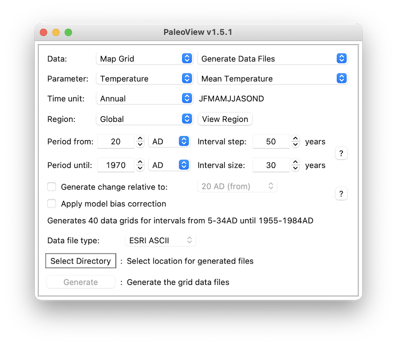

The Temperature Range Squeeze hypothesis
================

- [Description](#description)
- [Dependencies](#dependencies)
- [Usage](#usage)
- [Climate data](#climate-data)

## Description

Repository to reproduce the analyses in the paper *“Diurnal temperature
range as a key predictor of plants’ elevation ranges globally”*.

## Dependencies

Below are the different R packages required to run the code in this
repository:

- [tidyverse](https://www.tidyverse.org)
- [TRS.utilities](https://github.com/arnaudgallou/TRS.utilities/)
- [glue](https://glue.tidyverse.org)
- [bayesplot](https://mc-stan.org/bayesplot/) (only for model
  diagnostics)

To install TRS.utilities, use:

``` r
# install.packages("pak")
pak::pak("arnaudgallou/TRS.utilities")
```

In addition, you will need to have
[JAGS](https://sourceforge.net/projects/mcmc-jags/) installed on your
machine.

## Usage

Simply use the `main.R` file to run all the analyses performed in the
manuscript.

You can run multiple models automatically using a set of `for` loops.
For example:

``` r
# global-scale analyses

model <- load_model(scope = "global")

for (expr in c(~dtr, ~ts, ~past_dmat)) {
  for (elevation_span in ELEV_SPANS) {
    for (exclusion_zone in EXCLS) {
      mdl_data <- compile_mdl_data(
        trs,
        clim_data = trs_bioclim,
        elevation_span = elevation_span,
        exclusion_zone = exclusion_zone,
        singleton_thr = SINGLETON_THR,
        std_elev_grad = TRUE,
        average = TRUE,
        std_from = "top",
        cols = c("location", "sp_range", "land_type"),
        expr = expr
      )
      
      run_jags(
        mdl_data,
        model = model,
        n.iter = JAGS_ITER,
        n.thin = JAGS_THIN,
        n.chains = JAGS_CHAINS,
        n.burnin = JAGS_BURN_IN,
        save = TRUE,
        path = glue("data/jags/{model$scope}-scale/")
      )
      
      gc() # to free up RAM
    }
  }
}
```

Note that the `expr` parameter in `compile_mdl_data()` takes a
**formula** for the global-scale analyses and a **character string** for
the local-scale analyses.

A list of the different models ran in the manuscript can be found
[below](#models).

Once the models have finished running, use:

- `results.R` to plot model estimates and get model statistics
- `mdl_diagnostics.R` to perform model diagnostics

<a name="models" />

### Models

- Global-scale analyses:
  - main models: `~dtr`, `~ts`, `~past_dmat`
  - land type: `~dtr * land_type`, `~ts * land_type`,
    `~past_dmat * land_type`
  - climate-related interactions: `~dtr * ap`, `~dtr * mat`,
    `~past_dmat * past_map`
- Local-scale analyses: `"dtr"`, `"ts"`

### Gilchrist’s hypothesis

Run the following line to make the required data set to reproduce the
analyses on Gilchrist’s hypothesis.

``` r
trs_dtr_lower_third <- filter(trs, bio2 <= max(bio2, na.rm = TRUE) / 3)
```

Run the `~past_dmat` model using the `trs_dtr_lower_third` data set.

``` r
model <- load_model(scope = "global")

for (elevation_span in ELEV_SPANS) {
  mdl_data <- compile_mdl_data(
    trs_dtr_lower_third,
    clim_data = trs_bioclim,
    elevation_span = elevation_span,
    exclusion_zone = EXCL_DEFAULT,
    singleton_thr = SINGLETON_THR,
    std_elev_grad = TRUE,
    average = TRUE,
    std_from = "top",
    cols = c("location", "sp_range", "land_type"),
    expr = ~past_dmat
  )
  
  run_jags(
    mdl_data,
    model = model,
    n.iter = JAGS_ITER,
    n.thin = JAGS_THIN,
    n.chains = JAGS_CHAINS,
    n.burnin = JAGS_BURN_IN,
    save = TRUE,
    path = "data/jags/global-scale/gilchrist hypothesis/"
  )
}
```

Use the `GlobalAnalyses` class to plot model estimates:

``` r
gh <- GlobalAnalyses$new("data/jags/global-scale/gilchrist hypothesis")

gh$regressions(
  vars = "past_dmat",
  facet_cols = "elevation_span",
  labels = "∆ mean annual temperature (0-1980) (°C)"
)

gh$posterior_distributions(
  vars = "past_dmat",
  yvar = "elevation_span",
  facet = FALSE,
  reverse = TRUE,
  scales = .6
)
```

## Climate data

Climate data are already provided in the `trs.csv` data set.

If you would like to perform GIS analyses again, proceed as follows:

1.  Open `TRS.Rproj` and execute the following function in the console:
    `TRS.utilities::setup_gis()`. The function will create all the
    required directories to store SRTM and climate-related data.
2.  Download [bioclim](https://chelsa-climate.org/downloads/) and
    [digital elevation](https://earthexplorer.usgs.gov) data (as `.tif`)
    as well as
    [PaleoView](https://github.com/GlobalEcologyLab/PaleoView/releases).
    See [here](#paleoview) for instructions to generate past climate
    data.
3.  Save each file in the appropriate folder (see file tree below).
4.  Once all the files are in their respective folders, use the `gis.R`
    script to extract present and past climate data in each location.
    Output data will be stored in the `gis/clim/extracted/` subfolders.

<!-- -->

    gis
    ├── clim
    │   ├── data
    │   │   ├── past                        <- PaleoView-related folder
    │   │   │   ├── base                    <- past climate data go here
    │   │   │   └── var
    │   │   │       ├── mean precipitation  <- generated mean precipitation files go here
    │   │   │       └── mean temperature    <- generated mean temperature files go here
    │   │   └── present                     <- present bioclim files go here
    │   └── extracted
    │       ├── past
    │       └── present
    └── srtm                                <- save SRTM tiles in the corresponding subfolders
        ├── Afghanistan
        ├── Alborz Mountains
        ├── Azores
        ├── Baekdudaegan Mountains
        ├── Bioko
        ├── Canary
        ├── Cantabria
        ├── Cape Verde
        ├── Chicauma
        ├── Colombian Andes
        ├── Crete
        ├── Cyprus
        ├── Denali
        ├── Drakensberg
        ├── Euboea
        ├── Golestan
        ├── Hawaii
        ├── Hengduan
        ├── Jamaica
        ├── Jaya
        ├── Kenya
        ├── La Amistad
        ├── Lazio
        ├── Mt Ararat
        ├── Mt Etna
        ├── Mt Kilimanjaro
        ├── Nanga Parbat
        ├── Nepal
        ├── Nevada Test Site
        ├── Owens Peak
        ├── Reunion
        ├── Santa Rosa Mountains
        ├── Sierra Nevada
        ├── Sierra San Pedro Martir
        ├── Socotra
        ├── South-Eastern Pyrenees
        ├── Swiss Alps
        ├── Tahoe
        ├── Taiwan
        ├── Tajikistan
        ├── Tasmania
        ├── Utah
        ├── Venezuelan Andes
        └── Wind River Mountains

<a name="paleoview" />

### Generating past climate data

Open PaleoView and download the climate data (see chapter 2 of
[PaleoView’s user
manual](http://www.ecography.org/sites/ecography.org/files/appendix/ecog-03031.pdf))
for mean temperature and precipitation. Configure the input data
location (see chapter 3 in the user manual). Run PaleoView with the same
settings as shown in the image below for `temperature` and
`precipitation`:

</img>
